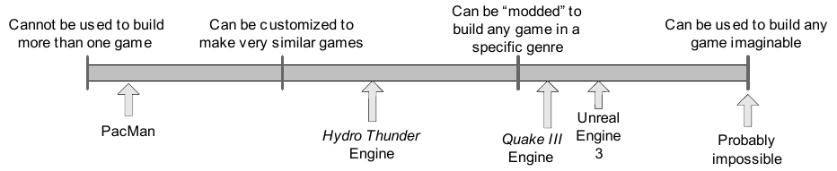
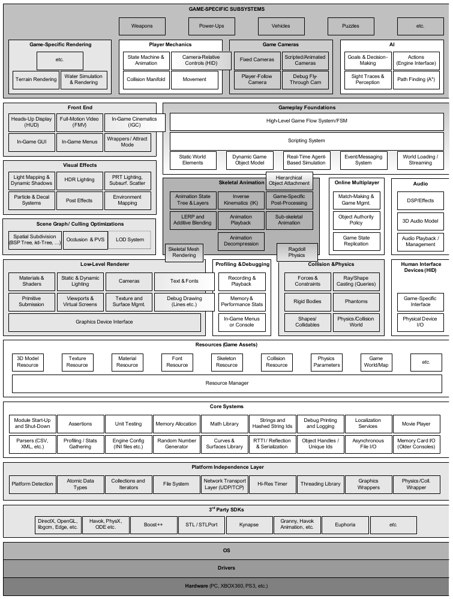

# What is a game and a game engine ?

## Game
* Intituevely easy to grasp the notion
* Complex to define per se

Include board games like chess, card games, casino games or even computer-based game. 

> A game is an interactive experience that provides the player with an increasingly cgallenging sequence of patterns which he or she learns and eventually masters (Raph Koster, A Theory of Fun for Game Design)

### Let's try to sum up important game concept's

* World(s)
* Rules
* Diegesis
* Interactions
* Activities
* Soft Real time simulation ?
* other things?

### Breaf peak into the Game Theory
[Introduction to Game Theory](https://fr.wikipedia.org/wiki/Th%C3%A9orie_des_jeux)

Study of games' strategies. Here @ IMT-LD we have the course *Stratégie de Résolution de Problème Complexe par le Jeu* strongly tied to this subject (Module électif L3).

## Game Engine

A game engine is a software-development environment designed for people to build video games.

### Context
In 1990, FPS games like DOOM changed the deal about how software components are developped.

* Well-defined
* Documented
* Reusable aspect and re-tooling in mind during conception

Objective: reduce the amount of hard-coded elements (such as game logic)

### Deep dive
From this new re-tooling coding paradigm results the separation of:
* Core software components
** 2D/3D rendering systems
** collision detection
** audio system
** ...
* Art assests
* Quest mechanism
* Rules of play
* Artificial Intelligence
* Network

 [1]

### One engine to rule them all?
Game engine are about trade-off!

Developping any piece of software entails making trade-off, based on the application and the context.
A rendering engine designed to handle intimate indoor environments will probably be less efficient in outdoor environments. This is due to the tech used under the hood. For the indoor engine, probably BFS tree and such to handle ambiant occlusion and a high LOD (level of details) and so on.

Example:
Star Citizen and CryEngine 3 then Lumberyard engine

So, game engine are generally dedicated to one (or few) genres
* FPS
* TPS
* MMO-X
* Fighting Game
* Racing
...

Nonetheless, huge progress in "the all in one", mostly Unity and UE.

### To conclude
A game engine is a tool suite and a runtime component.

 [1]

In this course, we will focus on **Collision & Physics**, some **2D Rendering** and **Player Mechanisms**, as well as **Artificial Intelligence**

Yay! \o/

`[1] Gregory, Jason. "Game Engine Architecture. Ak Peters Series." (2009).`
