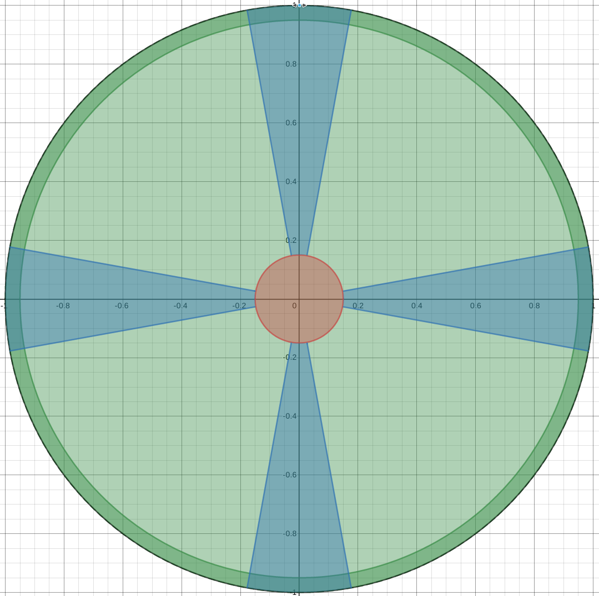

# Programming Input Devices

Input devices come in a wide range. They are the only devices that separate the player from the running game. These devices try to capture the intention of the user to perform an action into a specific space of inputs, only to be translated into comprehensible events by the game engine (through the input engine). Thus, both input devices and input engine need to be well designed to fit the human.

## Some example of device input
There is a large variety of devices nowaday, such as:
* Mouse
* Keyboard
* Controller's buttons (DS4, XBox)
* Analog Axes
* Accelerometes
* Camera
* ...

## Game Engine HID system and detecting IE (input events)
Retrieving low level event from input device is quite a tedious task.
Usually, the game engine you use should handle some of the inputs of the device, by wrapping them into either objects or structs.

Raylib offers a wide inputs wrappers.

### KB Down/UP
Invoking the `IsKeyDown()` boolean function allow us to check whether a specific key is currently pressed or not. Respectively, `IsKeyUp()` boolean function allows us to check is a specific key is **NOT** being pressed. There is also the `isKeyPressed()`, etc...

To use such input-related kb function, in the main loop, considers to check inputs before the update of the world.

```C
while(true)
{
    // Update
        //----------------------------------------------------------------------------------
        if (IsKeyDown(KEY_RIGHT)) playerPosition.x += 2.0f;
        if (IsKeyDown(KEY_LEFT)) playerPosition.x -= 2.0f;
        if (IsKeyDown(KEY_UP)) playerPosition.y -= 2.0f;
        if (IsKeyDown(KEY_DOWN)) playerPosition.y += 2.0f;
        //----------------------------------------------------------------------------------
    updateGameWorld();
}
```

### Mouse input-related function
The mouse is a more complex input device than a keyboard, mostly because it evolves in a 2D space, and in a continued space, discretized by the refresh rate of the embeded mouse's cpu. Therefore, two coordinates are generated periodically, in addition of mouse's click that can be performed by the player.

Generally speaking, clicks work the same as keys of a keyboard: we check if a mouse's button as been pressed or released and we take action accordingly.

```C
    if (IsMouseButtonPressed(MOUSE_LEFT_BUTTON)) ballColor = MAROON;
    else if (IsMouseButtonPressed(MOUSE_MIDDLE_BUTTON)) ballColor = LIME;
    else if (IsMouseButtonPressed(MOUSE_RIGHT_BUTTON)) ballColor = DARKBLUE;
```

However, mouse position implies coordinates, translated into the game world (either in 2D or 3D). Depending of the HID, mouse position has to be retrieved individually (first get the *x* then the *y*), or in a special structure. The later is done in raylib. You have a predefined `Vector2` struct representing coordinate in a 2D space, and the mouse position retrieving function has been implemented around this structure.

```C
    playerPosition = GetMousePosition();
    printf("X:%d" ; Y:%d", &playerPosition.x, &playerPosition.y);
```

You also can handle the mouse's wheel in raylib.

```C
boxPositionY -= (GetMouseWheelMove()*scrollSpeed);
```
### Game Controller
Game controllers become more and more common nowadays: they encompass a KB style approach with, generally speaking, two analog axises. Some of them can also embed accelerometers. However, they are quite identiqual in the way of handling the inputs, except that, some time, some extra driver are requiered in order to the OS to correctly interprets the device event.

Consequently, before taking into account inputs, one should identify if the gamepad is plug, and what king of controller it is. In raylib:

```C
if(IsGamepadAvailable(GAMEPAD_PLAYER1)) //GAMEPAD_PLAYER1 is a raylib enum
{
    if(IsGamepadName(GAMEPAD_PLAYER1, XBOX360_NAME_ID))
    {
        //..
    }
    else if(isGamepadName(GAMEPAD_PLAYER2, PS4_NAME_ID))
    {
        //..
    }
    else
    {
        printf("Generic Gamepad");
    }
}
```

Then, detecting button down is straightforward:
```C
    if (IsGamepadButtonDown(GAMEPAD_PLAYER1, GAMEPAD_BUTTON_MIDDLE_LEFT)) DrawRectangle(328, 170, 32, 13, RED);
    if (IsGamepadButtonDown(GAMEPAD_PLAYER1, GAMEPAD_BUTTON_MIDDLE_RIGHT)) DrawTriangle((Vector2){ 436, 168 }, (Vector2){ 436, 185 }, (Vector2){ 464, 177 }, RED);
    if (IsGamepadButtonDown(GAMEPAD_PLAYER1, GAMEPAD_BUTTON_RIGHT_FACE_UP)) DrawCircle(557, 144, 13, LIME);
```

And to retrieve an axis movement from a specific analog stick:
```C
GetGamepadAxisMovement(GAMEPAD_PLAYER1, GAMEPAD_AXIS_LEFT_X);
GetGamepadAxisMovement(GAMEPAD_PLAYER1, GAMEPAD_AXIS_LEFT_Y);
```

#### DO NOT FORGET THE DEAD ZONES!
If you use intensively a two-stick control scheme, it is most than probable that you observe during your QA phase that camera will behave weirdly.
This is often due to the fact that dead zone for pitch control is not taken into account. Therefore, if the stick is push not exactly on the X (or Y), then movement on the other axis (Y or respectively X) is also recorded: the camera will also move in an unwanted axis. Do not forget that.



To handle dead zone, in the easiest way you juste have to define a threshold, and check if it is reached.
```C
if(GetGamepadAxisMovement(GAMEPAD_PLAYER1, GAMEPAD_AXIS_LEFT_X) < threshold)
    input.x = 0.0f;
    return;
```

## Few tips
1. Make your objects or structures agnostic of the input devices !
Instead, map controls directly to the controlled objects. For example, in a A-RPG, if you have a double jump action allowed, a character could send the action **JUMP** or **DOUBLE JUMP** independently of the input device associated by being translated to the controler (not the input device) of the character.
2. Consider your control scheme carefully: do you want to stay with a well-known mapping or go in a new direction?
3. Be cautious with overloading simple controls with complicated results!
4. Always give the player some feedback. Not to much, thought!
5. Players won't use it if they don't know about it.
6. Avoid pixel perfect accuracy! Especially now with UHD resolution.
7. Think ergonomic!
8. Watch and learn