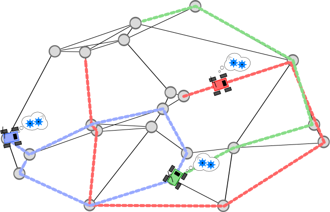

# Kick-off du module

NetWorld se veut devenir un moteur de jeux basé sur la librairie multi-plateforme RayLib, respectant le principe [KISS](https://fr.wikipedia.org/wiki/Principe_KISS)  (Keep It Stupid Simple).
La particularité du projet est de modéliser le monde comme un réseau de positions clés sur lesquelles peuvent de baller les entités en interaction.

Le developpement de NetWorld s'articule autour de 4 fonctionnalité pricipal:

- **Cadrage du project**: (Une fonctionnalité pour les controler toutes). Cette fonctionnalité couvre essenciellement la mise en place des outil utile à l'équipe de développement. Cést une meta-fonctionnalité ou une fonctionnalité support.
- **NetWorld, le monde vue comme un réseau**: NetWorld est un peut l'élément central de la librairie.
- **Les entités évoluant dans Networld**: Un monde n'est rien sans une peuplade. La particularité de ce composant de la lib. réside dans le fait que les entités sont en interactions.
- **interface utilisateur**: Ce composant logiciel focalise sur le rendu graphique et la mise en place de controle pour le joueur humain.

