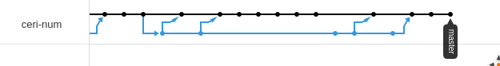

# Introduction to GIT

An excellent introduction to git is available here: [GIT-SCM, The entire Pro Git Book](https://git-scm.com/book/en/v2).

## Version Control In brief
When working on a project, coding files constantly evolve. Most of the time it consists of features implementation, but sometime their modification introduce regression to the software (*e.g.* bug). Some other time, collaboration is hard due the impossibility to easily share and coordonate the workforce (*e.g.* rewritting some parts of a code written by a colleague). GIT allows your files to exist in several state in --virtualy-- one time, and track their modifications, in addition to make them remotly accessible and provide some control access to them. It show how the files has evolved, and which conflict can potentially arise when modifying a specific file.

## GIT project
In GIT, you have two important notions: the local repository (the one in which you currently work) and remote repositories. Remote repositories are versions of the project that are hosted on the internet/network somewhere else than on your machine. Collaborating with others involves managing these remote repositories and pushing and pulling data to and from them when you need to share work. Some of them can be read-only for your, other read-write. But in any case, each system keeps a version database. One major stack of distributed versioning system is to keep the coherence of the software.


## GIT Repository
You have 4 majors ways to obtain a git repository

### Init
You can take a local directory that is currently not under version control, and turn it into a GIT repository.

```bash
cd /home/user/project
git init
```

This create all the resources needed to track the files and version control.

### Clone
You can get a copy of an existing GIT repository. The modification made localy can be directly push to the existing GIT repository. For that:

```bash
git clone https://gitlab.com/project/project.git
```

That creates a directory named `project`, initializes all the resources needed.
### Mirror
You can get a copy of an existing GIT repository and set it in a totally new GIT repository, while conserving all the versionning. For that, create a new repo on the server (*e.g.* GitHub, Gitlab) like `exampleuser/new-repository`, empty it preferably, then

```bash
git clone --bare https://gitlab.com/guillaume/networldorwhatever.git
cd networldorwhatever.git
git push --mirror https://github.com/exampleuser/new-repository.git
cd ..
rm -rf networldorwhatever.git
```

### Fork (not directly a GIT operation)
Fork is a special feature that allow to work on parallel of a repository, generally for developping new features or bug fixings, then proposing the improved code to the original repository for acceptance. In a way, you can still make your fork follow the evolution of the forked repo. Fork orperation is not a GIT operation per se, it is implemented by code hosting sites like GitHub. Thus, for GitHub, you first need to manually fork the desired repository by clicking on the fork button. Then, in order to keep your fork synced:
```bash
    git clone https://github.com/YOUR-USERNAME/YOUR_FORK_OF_THE_PROJECT
    cd YOUR_FORK_OF_THE_PROJECT
    git remote -v
    git remote add upstream https://github.com/forkedUser/PROJECT_USED_FOR_THE_FORK.git
```

then for syncing
```bash
    git fecth upstream
    git checkout master
    git merge upstream/master
```

## GIT Flow
Let's dive into what we can call the "classic" git flow. Once you are working in a git project localy cloned, the VCS automatically tracks the modification performed into the files. Once the modification have been done (... and eventually tested), one can want to make these modifications appear on the remote project, therefore making them accessible to everybody working in the project.

Let's say that you have successfully cloned a project. You have modified several files to add a special easter-egg in it locally. Now, you need to push these modification to the remote server.
Without making the following commands, the change will only be performed locally, and no one working with the `upstream` repository will see the modification.

### Files modifications
File modifications are automatically tracked by git once they are modified. To show the state of the git project, and thus which files have been modified:

```bash
git status
```

It will list all the new files of the project, as well as the removed and modified files. Use it extensively.

Therefore, it should be the first command you type in the workflow, in order to be sure that the file you are interested in is ok.

In addition, modifications tracking can be integrated into some usefull tools, such that your command line or even your IDE -- often through the use of add-on.

### Confirm modifications
After consulting the state of your git project, modification **HAS TO** be manually confirmed. Otherwise, they will not be considered as part of the project. This is a particularity, since your local repository will suffer the modification, but not the remote, even if you perform the next two commands.

Thus, in order for git to take into account the modifications, say, in the FILENAME file, the command is:
```bash
git add FILENAME
or
git add -A
```
Where `git add -A` valids (incrementally add) all the changement tracked by `git status`. Be carefull if you delete some elements in your local repository.

Note: pushing the changes to the remote repository will have no effect yet, because the changes are not recored yet to the repository.

### Commit
Commiting your work means to record all the added modifications (from the command `git add`) to the repository. This command has an interesting effect of your project, since it will create **a new state of the project** encompassing all the modifications previously added. If you visualize your local repository as a tree, then the `commit`command will create a new node, where you are currently with the new version of the modification.



To commit your change to the repository, simply use the command:
```bash
git commit
```

Then, you will have to write your commit message (they are mandatory!). The first line should be a short description of the modification (*e.g. introducing dice roll*). Lines below can be used to write intensive description.

### Push
To make your modification accessible to everyone in the project, you need to push the commited change to re remote repository. Note that you can commits in local multiple times before making a push. This is usually a good practice if you commit small increment of a big features. Then, once the feature is ready, push it to everyone else.

```bash
git push
```

If your git is not correctly configured on your machine, you will have to set an user.name and an user.email, used to identify the person who perfomed the push action on the remote server.
You may need to log yourself before the push being authorized.

Once the operation is done, you can see the new push in the remote (go check your gvipers account for example).

#### Word of advice
It is principally during this step that conflicts may happen. A conflict is when the VCS cannot handle by itself the evolution of a file which has evolve in two different way. For example a person A delete the function at line 50, while person B push an improved version of the function at line 50. You will have to manage yourself the resolution.

When git detect a conflit during a merge, it **PERFORMS** the merge, **but** put some special balise in the incriminated file.

```
<<<<<< HEAD
this is some content to mess with
content to append
=======
totally different content to merge later
>>>>>> new_branch_to_merge_later
```
You have to chose which one you want to conserve, or replace them both by another choice. In some IDE or online GIT VCS such as GitLab, the conflict solving can be done by simply clicking on a bouton.
Then, you have to recommit another time (and push if you perform the conflict solving on a local branch).

## Branching
Nearly every VCS has some form of branching support. Branching means you diverge from the main line of development and continue to do work without messing with that main line. GIT has a pretty strong and intelligent branching system, preventing to much code duplicata and thus keeping your project relatively small in size.

The main objectif of a branch should be to develop a new feature, algorithm or anything whitout making the main line unusable. Generally speaking, your mainline should only have commit that run, so that you can rollback to them with no issues. On the opposite, your branches are you experimental playground. You create, delete, modify files, resources and co. of your project.

For example, let's say you want a new IHM for your game, to replace the ancient one. One can create a new branch (and jump in it) in the local repository

```bash
git checkout -b myNewBranch
```

where no apparent modification can be see compared to the branch where we came from (even **master** is a branch). All the modification made in `myNewBranch`stay in it, and even adding and commiting only concerned it.

You can push a branch to the remote like the master, supposing that you are in the branch:
```bash
git push
```

If the branch does not exist in the remote, you need to create it first, so instead of simply doing a push, the first time, you have to do
```bash
git push --set-upstream <YOURREMOTE> <YOURBRANCH>
```
(Tips: Upstream branches define the branch tracked on the remote repository by your local remote branch (also called the remote tracking branch) ).

Some example of branches:

### Branch overview
What happens when invoking the branch command


### Working on a branch
Branch ahead of master, developping a feature, and linear approach.


### Working on a big project
Desynchro and possible merge conflicts


### Navigation
To navigate between your branch, use the checkout command
```bash
git checkout BRANCH_NAME
```

By doing so, you change the current branch and adopting its current state. All the future modification will be applied to this very branch.

Note : if you want to change branch while some modifications has not been commited, you will need either to commit them or to stash them.

## GIT Workflow
We recommand you to adopt the *Integration Manager Workflow*. It is a common Git workflow, which involves an integration manager — a single person who commits to the 'blessed' repository. A number of developers then clone from that repository, push to their own independent repositories, and ask the integrator to pull in their changes. This fits well with the role repartition of the project.


## Question ?
Try the commands yourself !
Go to [Explain Git With 3D](https://onlywei.github.io/explain-git-with-d3/#commit) and play with it!

## Now ! Let's mirror on Gvipers !
Take 10 minutes to create a new repository on the IMT's GitLab Gvipers.
