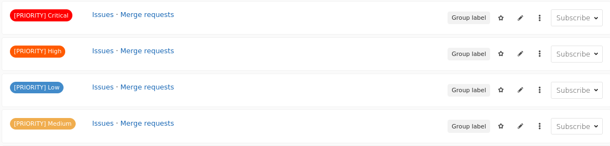
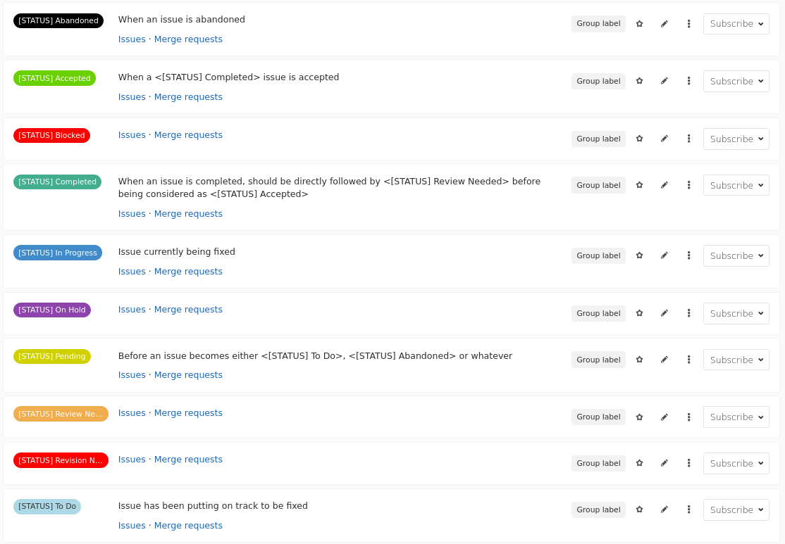
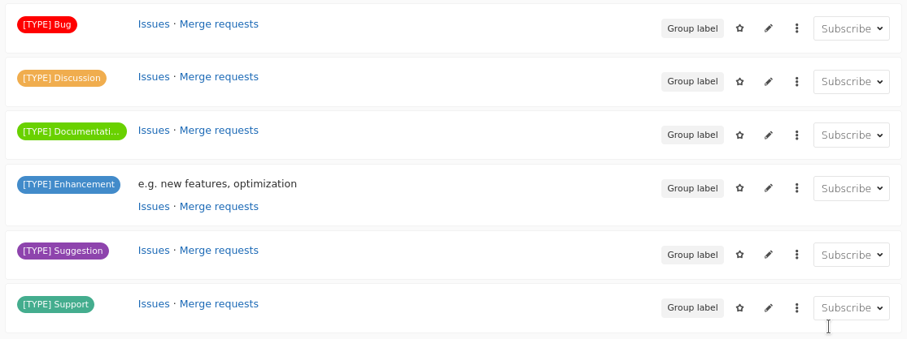
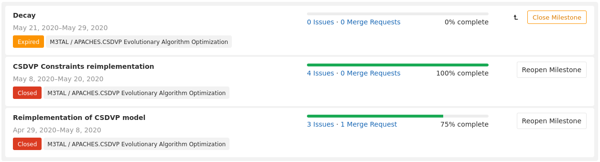
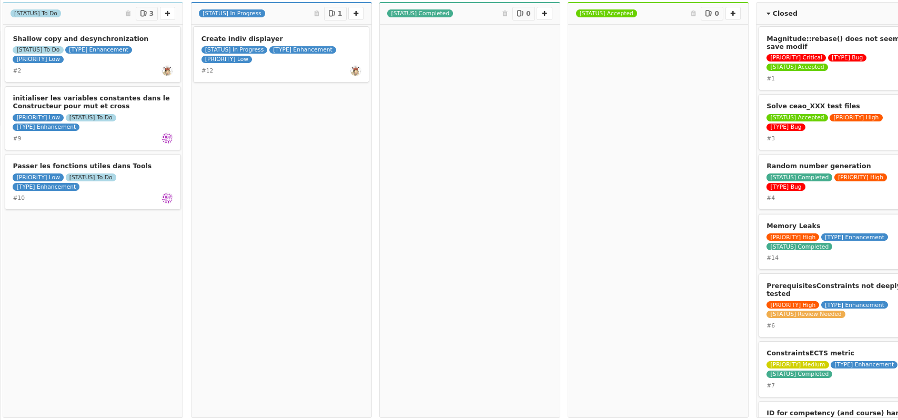

# Project Management in online GIT plateforme

## Disclaimer
There is no one good solution to manage your project and the team. You should discuss between you what should be the best practices to adopt in order to have an healthy project.

Nonetheless, we give you here some tips that can help you for your project and the futur ones.

## Adopt a good Git Workflow
As presented previously, a good workflow is important to handle how the repository evolve.
Instead of letting everyone performing actions on it (*e.g* merge, conflict resolution, commit...), appoint some persons to do the job.

We encourage you to adopt the *Integration Manager Workflow* shown in the previous slide.

## Labels are your friend!
Use label intensively! But with consistency and logic.

A good approach is to define three specific categories of labels:

* PRIORITY: used to define a task priority (*e.g.* High)
* STATUS: used to define the statue of a task (*e.g.* To do)
* TYPE: used to define the type of the label and/or intervention (*e.g.* Bug)

Then, for each task/issue/element, assign only 1 label from priority, one from status and one from type.

**TIPS**
In GitLab, you can define for a group a set of labels available for all the projects of the group. We recommand you to clearly define the label at the level of the group, then add some specific label if needed directly in the project. 

### PRIORITY

### STATUS

### TYPE

## Issues, issues, issues!
Issue board is a good way to organize and plan your work, especially if you have a good labelisation system.

Create issue for tasks that need to be tackle down, or bug, or enhancement. You can also assign person to the issue, making explicit whom is supposed to work on what. Moreover, you can estimate needed time, and track time spent in a issue by using some [quick actions commands](https://gvipers.imt-lille-douai.fr/help/user/project/quick_actions).

Issue can be resolved, reopened, commented, and so on. You can point to a specific commit by its *hash*.

## Milestone
Milestone constitutes important step of your project, such as the *proof of concept*, *working example*, *alpha* and the famouse *v1.0*. For each milestones, you can associates issues to it, showing how the its progression goes.

## Board
The board in GitLab is a powerful tool, if you use a good labeling system combined to the milestone approach. It allows you to have an interactive task board, directly link to your code and your progression through the issues system.

## And more, like:
Git(Lab/Hub) implements Continuous Integration / Continuous Development (CI/CD) pipelines to help you improve your code quality.